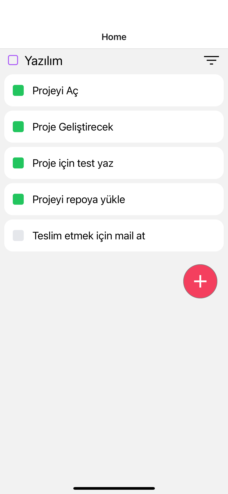
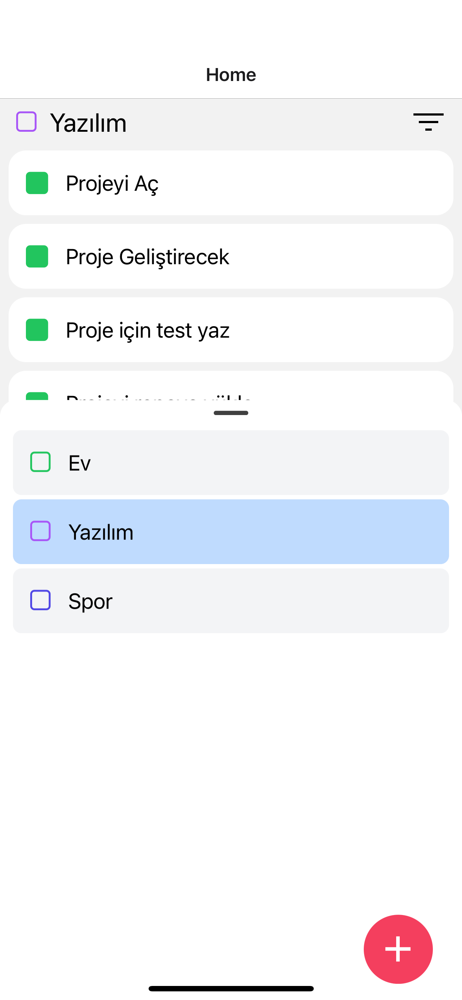
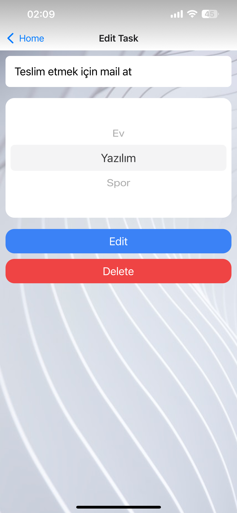
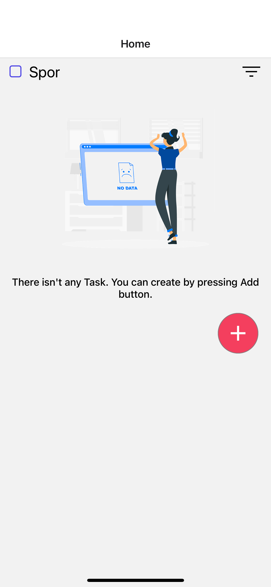
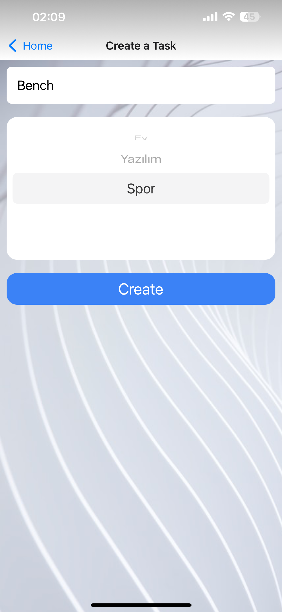

# 🌟 Basic TODOApp Challenge

## Table of Contents 📚

- [About The Challenge](#-about-the-app)
- [Project Structure](#-project-structure)
- [Demo Video](#-demo-video)
- [Screenshots](#-screenshots)
- [Technologies](#%EF%B8%8F-technologies)
- [Setup](#-setup-instructions)

## 📱 About The App

This application is specifically designed to help you plan your day effectively. You can set tasks and daily goals for various categories, mark completed tasks, delete or update them.

## 📋 Features

- **Task Management**: Create, update, and delete tasks for different categories.
- **Task Completion**: Easily mark tasks as completed once you finish them.
- **Category-based Organization**: Categorize your tasks to keep your day organized.
- **Intuitive UI**: A user-friendly interface for seamless interaction.

## 📁 Project Structure

<pre>
📁 __mocks__               # Mocks for testing
📁 __tests__               # Test files
📁 .github
   📁 workflows            # GitHub Actions workflows
📁 assets
   📁 icons                # Icon assets
   📁 images               # Image assets
📁 src                     # Source code
   📁 assets               # Project asset files
   📁 components           # Reusable components
   📁 navigation           # Navigation routes
   📁 screen               # Main application views
   📁 store                # zustand related files
   📁 types                # interfaces related files
   📁 utils                # project related utils
     📁 helpers            # Helper functions
     📁 theme              # Application theme folder
📜 .eslintignore           # ESLint ignore file
📜 .eslintrc.js            # ESLint configuration
📁 .gitignore              # Git ignore file
📜 app.json                # Application configuration
📜 App.tsx                 # Main application entry point
📜 babel.config.js         # Babel configuration
📜 eas.json                # eas configuration
📜 jest.config.js          # Jest testing configuration
📜 package.json            # Node.js package configuration
📜 README.md               # Project documentation
📜 tsconfig.json           # TypeScript configuration
</pre>

## 🎥 Demo Video

https://github.com/arslanarso/react-native-todo-app/assets/90643738/95920881-5959-45a2-a6ec-8ec6a1a28998

## 📸 Screenshots

<div align="center">
  
  
</div>

<div align="center">
  
  
</div>

<div align="center">
  

</div>

## 🛠️ Technologies

The mobile app leverages the following key technologies and libraries:

- [**React Native (TypeScript)**](https://reactnative.dev/) - The foundation of the app, allowing for cross-platform mobile development with strong typing and code quality. 📱

- [**@gorhom/bottom-sheet**](https://www.npmjs.com/package/@gorhom/bottom-sheet) - A flexible BottomSheet component for React Native.

- [**@react-native-async-storage/async-storage**](https://www.npmjs.com/package/@react-native-async-storage/async-storage) - An asynchronous, persistent, key-value storage system for React Native. 💾

- [**@react-native-picker/picker**](https://www.npmjs.com/package/@react-native-picker/picker) - A cross-platform Picker component for React Native.

- [**@react-navigation/native**](https://reactnavigation.org/) - Routing and navigation for React Native.

- [**@react-navigation/native-stack**](https://reactnavigation.org/docs/stack) - Stack navigator for React Navigation.

- [**@shopify/restyle**](https://github.com/Shopify/restyle) - Utility functions and components for building design systems with React and React Native.

- [**chalk**](https://www.npmjs.com/package/chalk) - Terminal string styling done right.

- [**Expo**](https://expo.dev/) -A comprehensive framework and toolset for building React Native applications with ease. 📦

- [**nanoid**](https://www.npmjs.com/package/nanoid) - A tiny, secure, URL-friendly, unique string ID generator. 🆔

- [**react-native-reanimated**](https://docs.swmansion.com/react-native-reanimated/) - React Native's Animated library reimplemented.

- [**react-native-screens**](https://github.com/software-mansion/react-native-screens) - Native navigation primitives for your React Native app.

- [**zustand**](https://github.com/pmndrs/zustand) - A small, fast, and scaleable state-management library. 🐻

- [**Jest**](https://jestjs.io/docs/tutorial-react-native) - A testing framework used for unit testing and ensuring the app's reliability. 🧪

These core technologies, along with others, come together to create a powerful and user-friendly TODOApp.

## 🚀 Setup Instructions

To get started with the **TODOApp** mobile app on your local development environment, follow these steps:

#### ✅ Prerequisites

Before you begin, make sure you have the following prerequisites installed:

- [Node.js](https://nodejs.org/): Ensure you have Node.js installed. You can download it from the official website.

- [npm](https://www.npmjs.com/) or [Yarn](https://yarnpkg.com/): Choose either npm or Yarn as your package manager.

- [Expo CLI](https://docs.expo.dev/get-started/installation/): Install Expo CLI globally on your machine.

### 🚚 Install Dependencies

```shell
npm install
```

### 🏃‍♀️ Start the Development Server

To run the app in development mode, use the following commands:

#### 🏁 Start Project :

```shell
npm start
```

#### 🍎 iOS Simulator (requires macOS and Xcode):

```shell
npm run ios
```

#### 🤖 Android Emulator (requires Android Studio):

```shell
npm run android
```

### 🧪 Testing

```shell
npm test
```
